
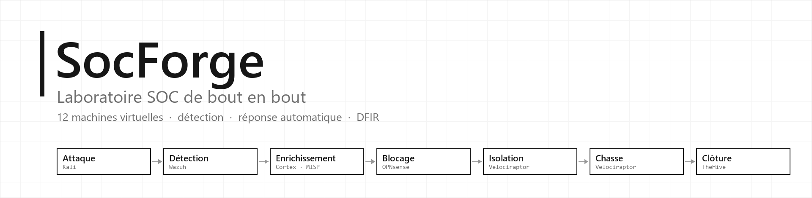

# SocForge

Un laboratoire SOC complet sur un seul PC, avec VirtualBox : douze machines virtuelles, de la détection
jusqu'à la réponse. Chaque détection a été déclenchée par une vraie action offensive, bénigne, lancée depuis une machine
Kali ou, pour les techniques locales, sur le poste visé, puis observée dans le SIEM et documentée avec ses journaux, ses heures UTC et des captures d'écran.

Le projet va jusqu'au bout d'un incident : une seule attaque est suivie à travers toute la chaîne (détection,
orchestration, enrichissement, blocage réseau, isolation du poste, chasse, clôture du cas). Le détail est dans la
fiche [SC-14](purple-team/scenarios/SC-14-shuffle-soar-workflow.md).

Quelques chiffres : 12 machines, 16 fiches de scénario, 29 règles de détection écrites pour le lab, 5 zones
réseau filtrées, une chaîne d'automatisation de 6 nœuds et 47 captures. Sur l'attaque suivie, Wazuh alerte en
1 à 7 secondes, l'alerte arrive dans TheHive 7 secondes après sa livraison, l'adresse de l'attaquant est bloquée
à 24 secondes, l'ordre d'isolation du poste part à 29 secondes et la chasse est demandée à 35 secondes
([métriques](docs/metrics-mttd-mtta-mttr.md)).

Ce README raconte le projet dans l'ordre où il a été construit, étape par étape, avec les 47 captures prises
sur le lab. Sur chaque capture, les cadres rouges montrent ce qu'il faut regarder : la requête, le nombre de
résultats, la ligne ou la valeur qui prouve le point. Les fiches de scénario donnent ensuite la commande exacte,
les journaux et le nettoyage.

| Étape | Contenu | Captures |
|---|---|---|
| 1 | Collecter les journaux et les voir dans Wazuh | 1 |
| 2 | Détecter les techniques sur Windows et Linux | 12 |
| 3 | Surveiller et cloisonner le réseau | 6 |
| 4 | Automatiser la réponse : Shuffle, TheHive, Cortex, MISP | 8 |
| 5 | Chasser sur les postes à partir du renseignement | 12 |
| 6 | Une attaque suivie de bout en bout | 8 |

Les tableaux de bord affichent l'heure locale du lab (UTC+1). Les fiches et les journaux sont en UTC.

Pour lire les captures sans se tromper, trois repères :

- Elles viennent de deux périodes. Celles des étapes 1 à 5 ont été prises du 17 au 25 septembre 2026, pendant la construction du lab : ce sont des tests séparés, un par technique ou par brique. Celles de l'étape 6 viennent toutes de l'attaque du 7 octobre 2026. Seule exception dans les étapes 1 à 5 : les deux captures de la chasse Linux, à la fin de l'étape 5, prises elles aussi le 7 octobre.
- Les adresses ont changé entre les deux. En septembre, Kali et les cibles avaient encore une carte sur le réseau de gestion : Kali apparaît en `10.10.10.60`, DC01 en `10.10.10.109`, WIN01 en `10.10.10.110`. Ces cartes ont ensuite été retirées pour que l'attaquant et les cibles ne communiquent plus qu'à travers le pare-feu. Le 7 octobre, PURPLE est en `10.10.50.10` et WIN01 en `10.10.30.110`.
- WIN01 porte deux noms selon l'outil : `WIN01` est le nom de son agent Wazuh, `DESKTOP-75LAKDV` son nom Windows, celui que Velociraptor et TheHive affichent. C'est la même machine.

## Architecture

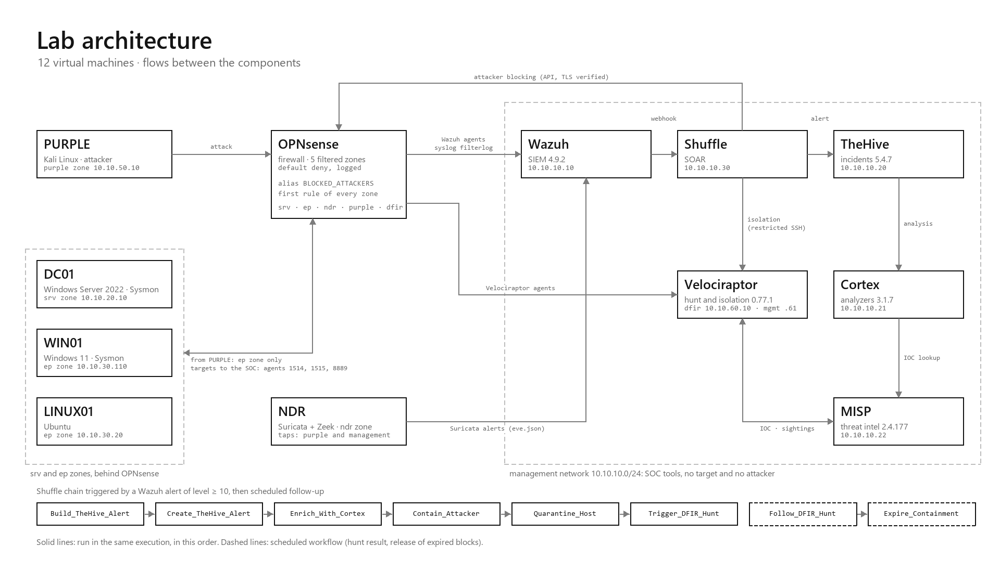

| Couche | Composants | Rôle |
|---|---|---|
| Attaque | PURPLE (Kali Linux) | lance les attaques, seul dans sa zone |
| Réseau | OPNsense, sonde NDR (Suricata et Zeek) | segmentation avec refus par défaut, détection réseau passive |
| Administration | réseau de gestion `10.10.10.0/24` | héberge les outils (Wazuh, Shuffle, TheHive…). Il n'est pas filtré : ni l'attaquant ni les cibles n'y ont de carte |
| Cibles | DC01, WIN01, LINUX01 | domaine Windows, poste Windows 11 avec Sysmon, serveur Ubuntu ; chacun a un agent Wazuh |
| Détection | Wazuh | reçoit les agents, le syslog du pare-feu et les alertes réseau |
| Réponse | Shuffle, TheHive, Cortex, MISP | orchestration, suivi d'incident, analyse, renseignement sur la menace |
| DFIR | Velociraptor | chasse sur les postes, isolation d'un hôte compromis |

L'inventaire complet (adresses, versions, flux) est dans [`docs/lab-registry.md`](docs/lab-registry.md). Un
rapport d'incident rédigé à partir d'une alerte réelle est dans
[`docs/incident-report-2026-09-24-cron-persistence.md`](docs/incident-report-2026-09-24-cron-persistence.md).

## Étape 1 : collecter et voir

Les trois cibles (DC01, WIN01, LINUX01) et la sonde réseau ont un agent Wazuh. Sur Windows, l'agent envoie les
journaux Security, PowerShell et Sysmon ; sur Linux, les journaux d'authentification et la surveillance
d'intégrité de `/etc/cron.d`. Le pare-feu envoie son journal par syslog. Avant d'écrire la moindre règle, il
fallait vérifier que tout cela arrivait bien au manager.

Le tableau de bord Threat Hunting le montre après une journée de tests : 3 956 alertes en 24 heures, dont 172 de
niveau 12 ou plus, et une répartition MITRE ATT&CK qui correspond aux techniques jouées (comptes valides,
injection de processus, PowerShell, tâche planifiée, mémoire de LSASS, partages d'administration).

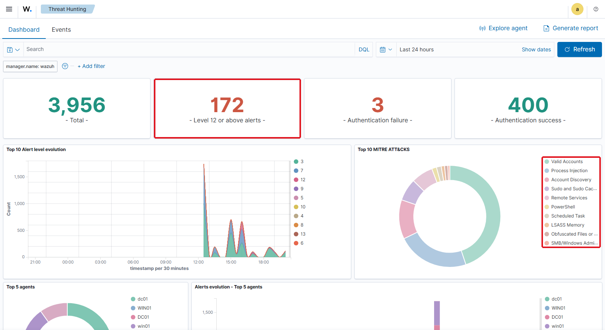

## Étape 2 : détecter les techniques sur les postes

Chaque technique suit la même méthode : lancer une action réelle et bénigne, regarder si la règle sonne, corriger
la règle si elle ne sonne pas, puis garder la preuve. Les 29 règles du lab sont dans `wazuh/rules/`, et les
défauts trouvés en les testant sont décrits dans la
[fiche de détection Windows](detections/windows/detection-sheet-windows.md) et la
[fiche Linux](detections/linux/detection-sheet-linux.md).

### Tâche planifiée et compte privilégié (SC-01, SC-02)

Sur DC01, une tâche planifiée est créée avec `schtasks`, puis le partage `C$` est monté avec le compte
administrateur. La console montre les deux commandes et leur résultat.

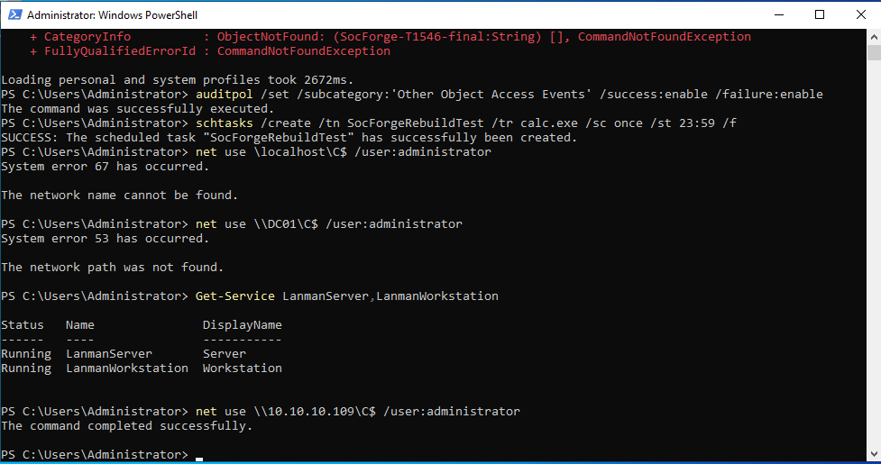

Dans Wazuh, la requête sur les deux règles renvoie 11 alertes : `100153` pour la création de la tâche
(événement 4698) et `100178` pour l'ouverture de session réseau du compte privilégié (événement 4624, type 3).
Fiches : [SC-01](purple-team/scenarios/SC-01-T1053-scheduled-task.md),
[SC-02](purple-team/scenarios/SC-02-T1078-valid-account.md).

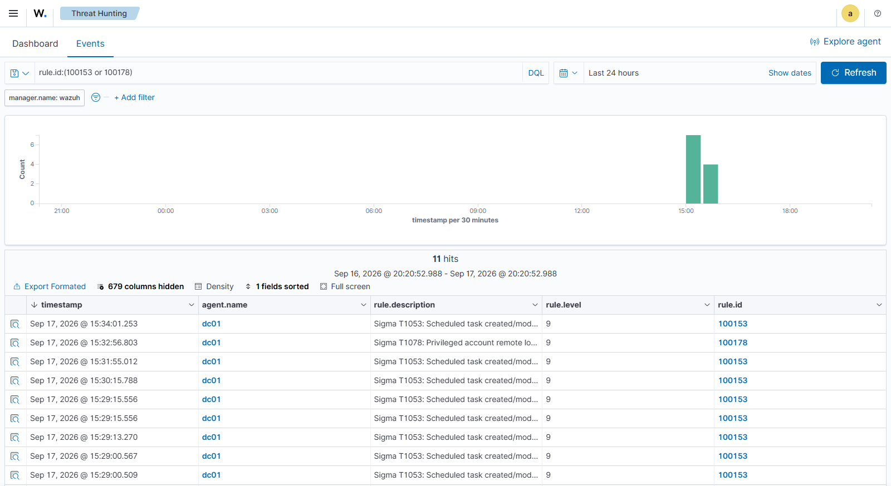

### Partages d'administration : séparer le bruit du signal (SC-03)

Un contrôleur de domaine accède sans arrêt à ses propres partages avec des comptes machine. Alerter sur tout
accès à `C$` ou `ADMIN$` noierait l'analyste. La règle `100139` classe donc ces accès de routine au niveau 3,
sans alerte, et la règle `100140` ne garde que les accès faits par un compte réel, au niveau 10. La capture montre
les deux côte à côte, ainsi que la règle `100186` qui signale la modification d'un profil PowerShell sur WIN01.
Fiche : [SC-03](purple-team/scenarios/SC-03-T1021-lateral-movement.md).

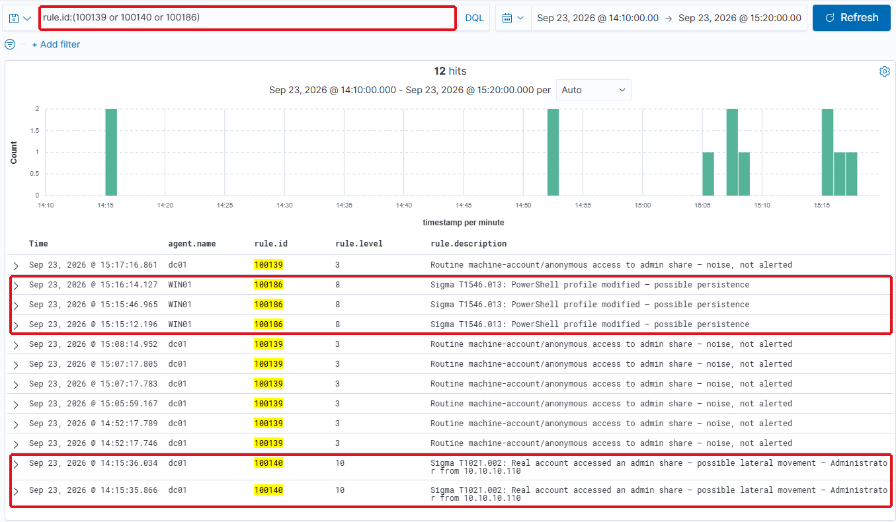

### PowerShell encodé (SC-04)

Sur WIN01, une commande PowerShell est lancée avec `-EncodedCommand`. Deux sources la voient : la création du
processus (événement 4688, règle `100121`) et le contenu du script une fois décodé par Windows (événement 4104,
règle `100131`). Le journal d'alertes du manager affiche les deux, de niveau 12, à dix secondes d'écart.

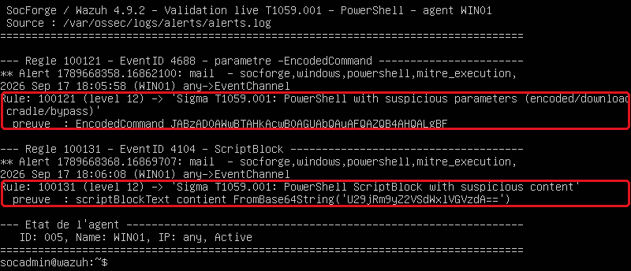

Le tableau de bord regroupe toute l'activité PowerShell de la journée sur WIN01 : 26 alertes, avec en tête les
deux règles de niveau 12, puis la création de processus PowerShell (`100120`) et les motifs Base64 (`100127`).
Fiche : [SC-04](purple-team/scenarios/SC-04-T1059-powershell-encoded.md).

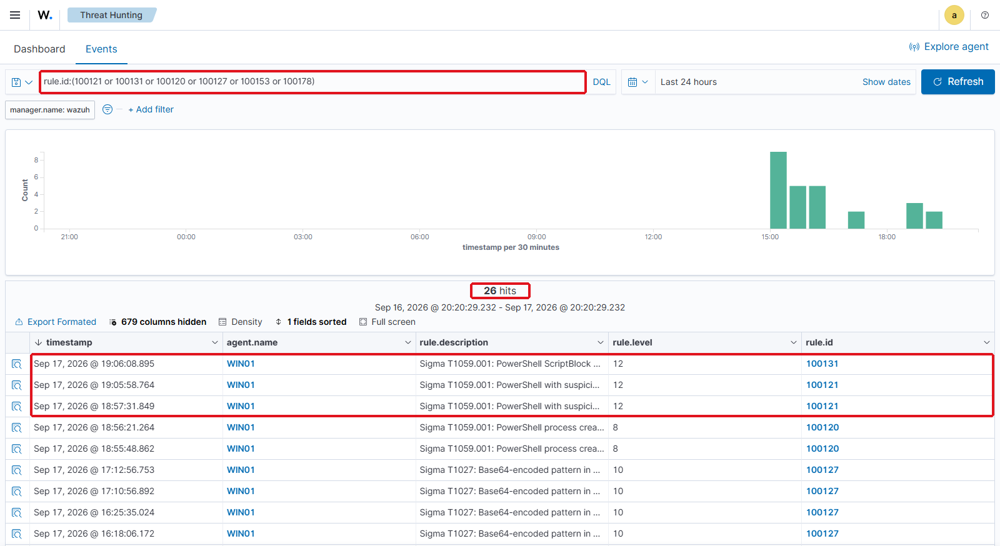

### Scan de ports depuis Kali (SC-05)

PURPLE scanne DC01 avec `nmap`. Chaque connexion vers un port sensible lève la règle `100101` (niveau 8). Quand
la même source touche plusieurs ports en peu de temps, la règle de corrélation `100102` monte au niveau 10 :
c'est elle qui dit « scan » et non « connexion isolée ». 60 alertes sur les quatre règles de la requête.
Fiche : [SC-05](purple-team/scenarios/SC-05-T1046-port-scan.md).

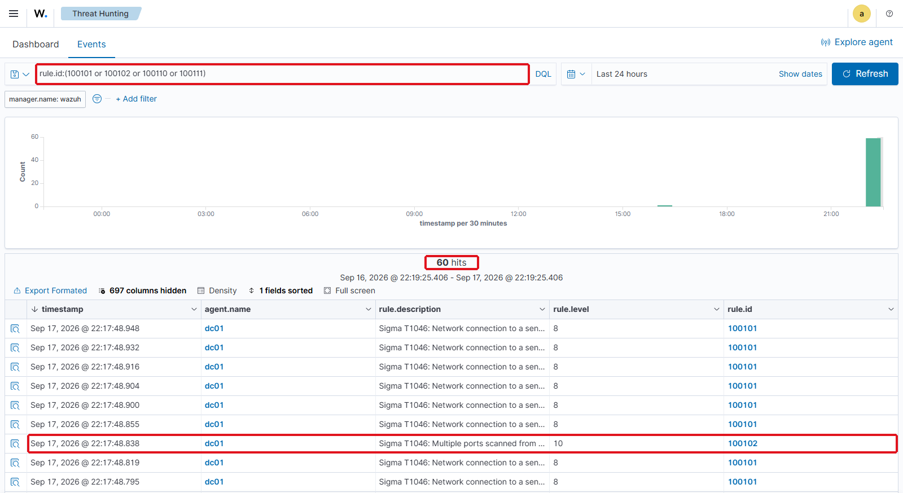

### Brute force SMB (SC-06)

Toujours depuis PURPLE, une série d'essais de mot de passe sur le compte administrateur de DC01. Chaque échec
donne une alerte `100110` de niveau 6 ; la répétition déclenche `100111` au niveau 10. 13 alertes au total.
Fiche : [SC-06](purple-team/scenarios/SC-06-T1110-brute-force.md).

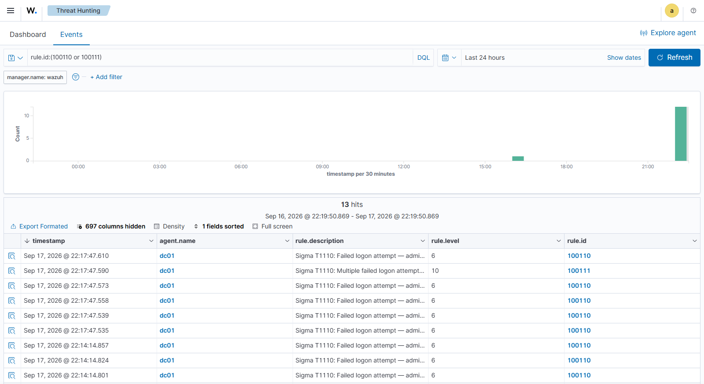

### sudo et persistance cron sur Linux (SC-07)

Sur LINUX01, des commandes lancées avec `sudo` lèvent la règle `100200` (niveau 9), et le dépôt d'un fichier dans
`/etc/cron.d` lève la règle `100210` (niveau 10) grâce à la surveillance d'intégrité en temps réel. 19 alertes.
Fiche : [SC-07](purple-team/scenarios/SC-07-T1548-T1053-linux.md).

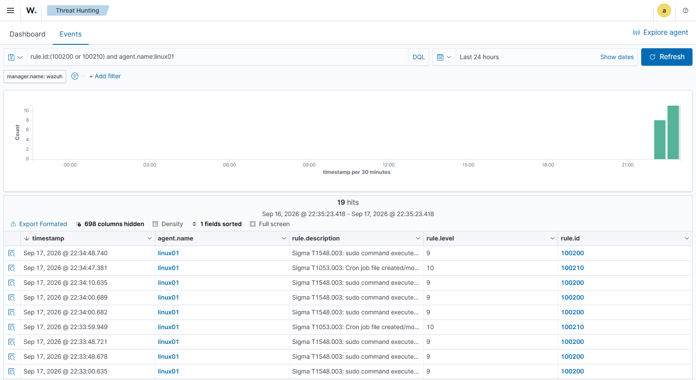

### Mouvement latéral de WIN01 vers DC01 (SC-08)

Depuis WIN01, le partage d'administration de DC01 est monté avec un compte du domaine. Deux règles se complètent
sur DC01 : `100178` voit la session du compte privilégié, `100140` voit l'accès au partage. Le test a été joué
deux fois dans la journée, d'où les 6 alertes.
Fiche : [SC-08](purple-team/scenarios/SC-08-T1021-win01-to-dc01.md).

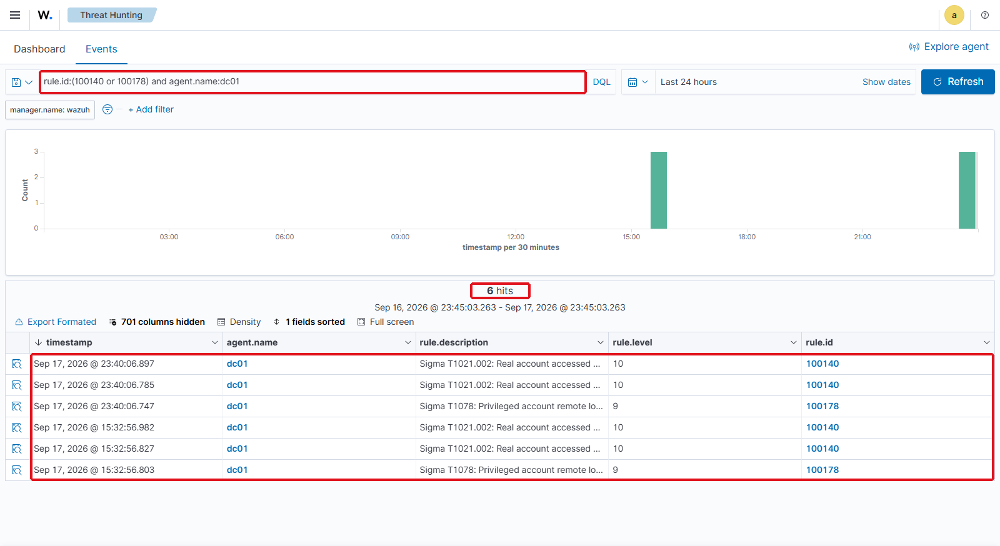

### Persistance par clé Run (SC-09)

Une valeur est écrite sous la clé `CurrentVersion\Run` de WIN01. Sysmon journalise l'écriture (événement 13)
et la règle `100147` alerte au niveau 9. C'est la règle qui a demandé le plus de recherche : elle ne sonnait
pas tant qu'elle était rattachée par `if_group`, et sonne depuis qu'elle l'est par `if_sid`.
Fiche : [SC-09](purple-team/scenarios/SC-09-T1547-registry-run-key.md).

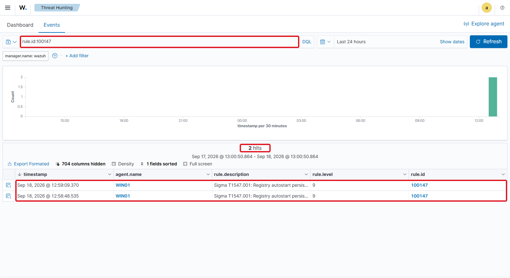

### Injection de processus (SC-10)

Un script crée un thread dans un `notepad.exe` local avec `CreateRemoteThread`, sans y écrire de code. Sysmon
produit l'événement 8 et la règle `100155` alerte au niveau 13. Les 17 résultats pour un seul test montraient
le bruit de cette règle. Il a été analysé le 7 octobre : 16 des 18 alertes gardées par le manager étaient le signal
Ctrl+C que Windows envoie aux programmes console. La règle `100156` classe ce cas au niveau 3, sans alerte, et le
rattachement de la règle `100155` a été corrigé à cette occasion.
Fiche : [SC-10](purple-team/scenarios/SC-10-T1055-process-injection.md).

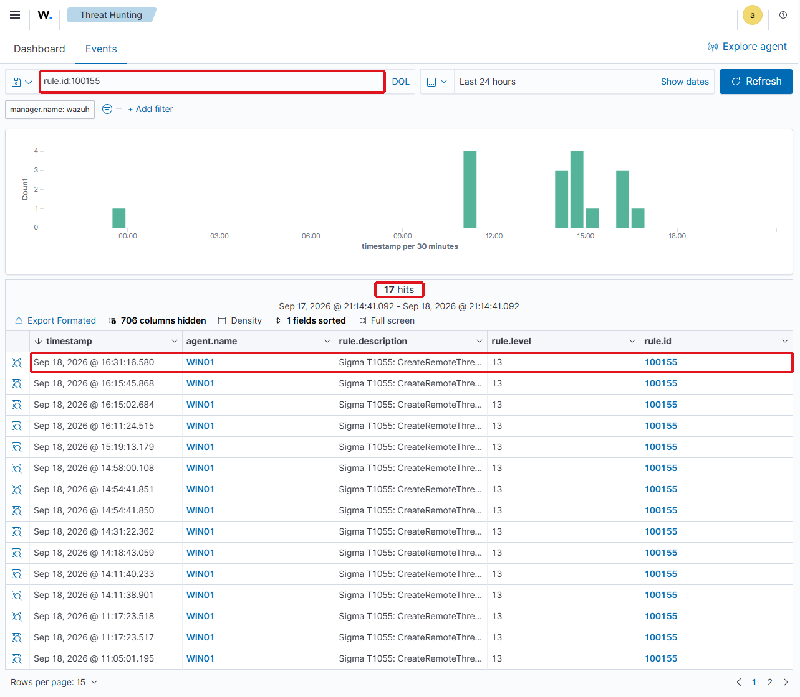

### Accès à la mémoire de LSASS (SC-11)

Sur WIN01, la protection LSA de Windows refuse l'ouverture de `lsass.exe` avant même que Sysmon la voie : la
défense fonctionne, il n'y a rien à détecter. Sur DC01, où cette protection n'est pas activée, l'accès est
accordé et la règle `100103` alerte au niveau 14, deux secondes après la tentative. La capture montre le processus
source (`powershell.exe`) et le masque d'accès `0x1010`.
Fiche : [SC-11](purple-team/scenarios/SC-11-T1003-lsass-access.md).

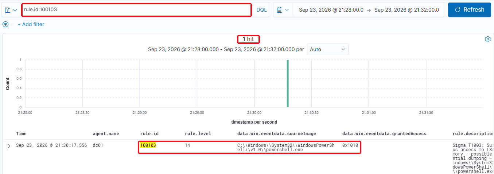

## Étape 3 : surveiller et cloisonner le réseau

### La sonde réseau (SC-12)

Une machine dédiée écoute le trafic en copie, avec Suricata (52 795 signatures ET Open) et Zeek. Ses alertes
remontent dans Wazuh par un agent. Lors d'un scan lancé depuis Kali, Suricata reconnaît les sondes vers les ports
de bases de données, SSH et la détection de système de `nmap`. La règle `100400` les transforme en alertes de
niveau 10, là où l'alerte Suricata brute (`86601`) reste au niveau 3.

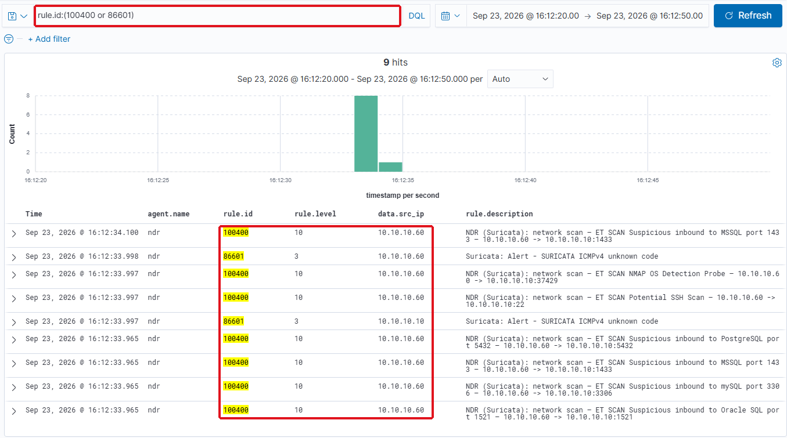

La sonde écoute aussi la zone de l'attaquant. Ici, l'interface `enp0s10` capte un ping de PURPLE (`10.10.50.10`)
vers le manager : le trafic de cette zone est bien vu par la sonde.
Fiche : [SC-12](purple-team/scenarios/SC-12-ndr-purple-scan.md).

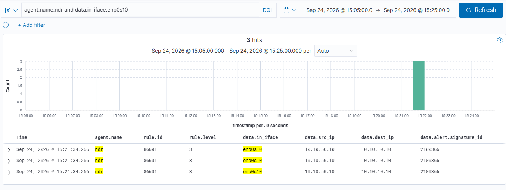

### La segmentation (SC-16)

OPNsense sépare cinq zones avec un refus par défaut. La politique tient en 17 règles, décrites dans
`firewall/segmentation-policy.json` et appliquées par l'API. Deux groupes comptent ici : PURPLE n'a le droit de
joindre que les cibles de test, et cinq règles de confinement, une par zone, rejettent toute adresse placée dans
l'alias `BLOCKED_ATTACKERS`. Ce sont elles que la réponse automatique utilisera à l'étape 6.

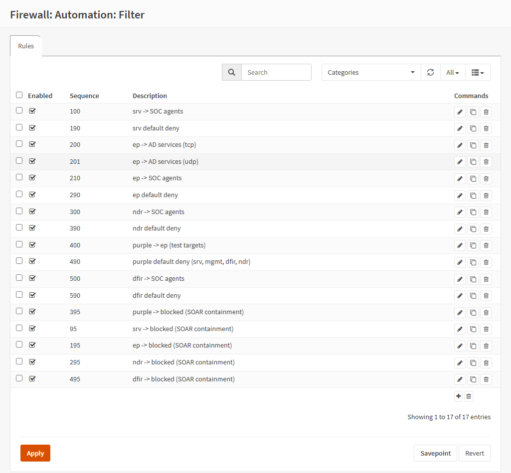

Le journal du pare-feu arrive dans Wazuh. Quand PURPLE scanne les autres zones, chaque paquet refusé donne une
alerte `100301` (niveau 8), et la répétition déclenche `100302` au niveau 12 : un scan entre zones.

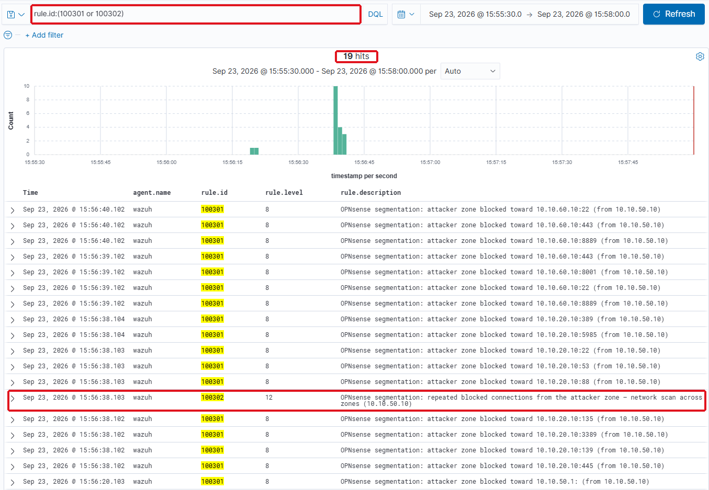

Même résultat quand PURPLE essaie de joindre le manager Wazuh sur le port des agents : huit alertes, toutes avec
l'action `block`. L'attaquant ne peut pas atteindre les outils du SOC.
Fiche : [SC-16](purple-team/scenarios/SC-16-firewall-segmentation.md).

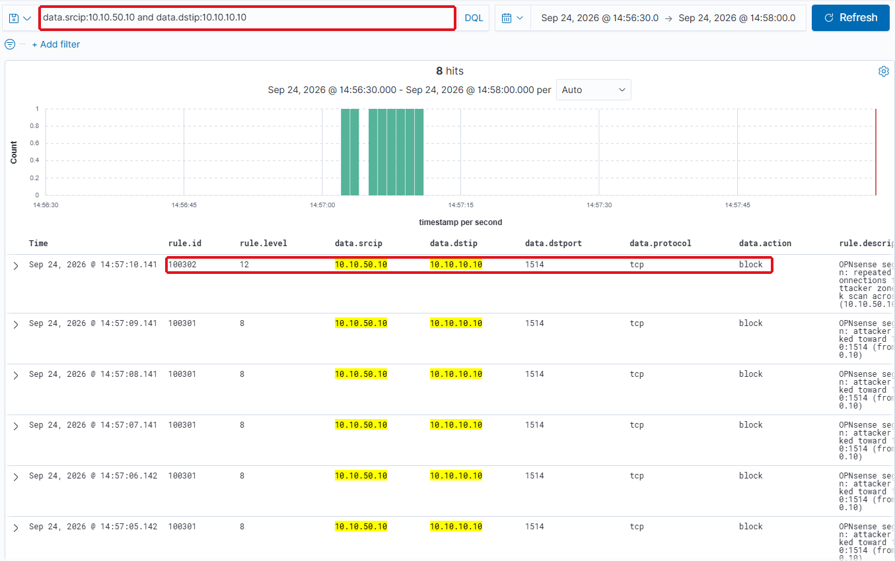

Le mécanisme de confinement a d'abord été testé seul, avec une adresse de documentation : le script
`firewall/contain_attacker.py` l'ajoute à l'alias, l'interface d'OPNsense la montre, puis
`uncontain_attacker.py` la retire.

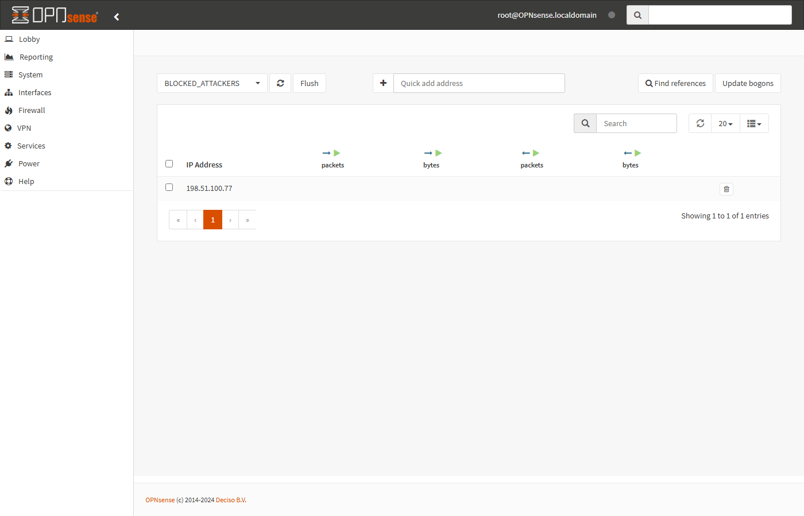

## Étape 4 : automatiser la réponse

### Première alerte dans TheHive (SC-13)

Le raccordement a commencé à la main : une alerte créée dans TheHive par l'API, avec le compte de service, à
partir de l'alerte Wazuh `100155`. Elle porte la technique, la source et la référence de la règle. Ce test a fixé
le format que Shuffle reprendra.
Fiche : [SC-13](purple-team/scenarios/SC-13-thehive-cortex-100155.md).

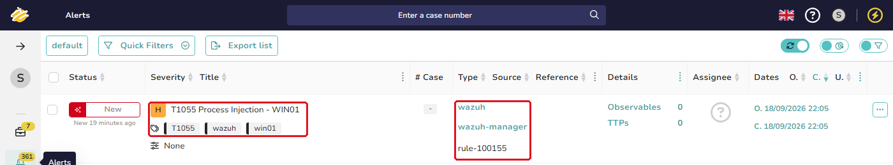

### De Wazuh à TheHive sans intervention (SC-14)

Le manager Wazuh envoie ensuite lui-même à Shuffle toute alerte de niveau 10 ou plus. Pour la mise au point de la
chaîne, le déclencheur de ces essais est un fichier cron de test déposé sur le serveur Wazuh lui-même : c'est
pourquoi l'agent s'appelle `wazuh` dans les captures de cette étape. La règle est la
même que celle validée sur LINUX01 à l'étape 2. L'exécution ci-dessous est
déclenchée ainsi : source `webhook`, règle `100210`, quinze secondes de bout en bout, et TheHive répond `201` à la
création de l'alerte.

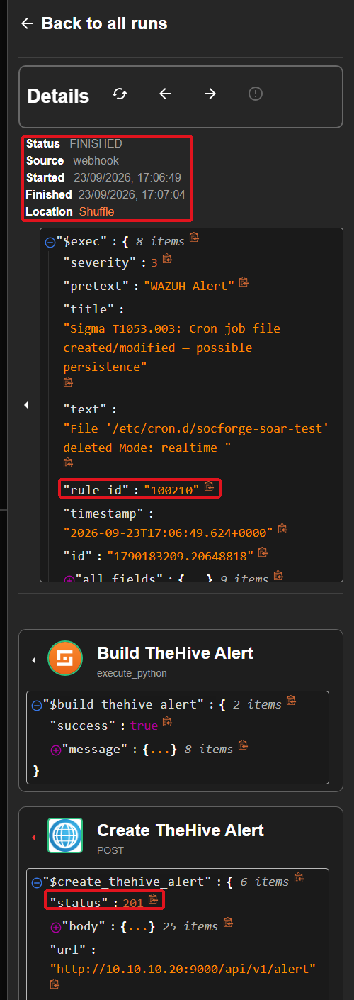

L'alerte arrive dans TheHive avec ses tags et, en référence, l'identifiant de l'alerte Wazuh d'origine. On peut
donc toujours remonter de TheHive au journal brut.

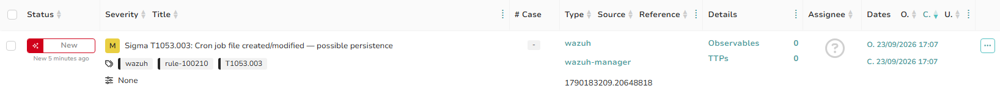

### Enrichissement par Cortex et MISP

Un deuxième workflow lit les observables de l'alerte, en extrait l'adresse et la soumet à l'analyseur Cortex
`MISP_SocForge`, qui interroge MISP. La capture montre l'adresse extraite pendant l'exécution et la réponse `200`
de Cortex, c'est-à-dire que l'analyse a bien été lancée. Le résultat de l'analyse se lit deux captures plus bas,
sur l'observable dans TheHive.

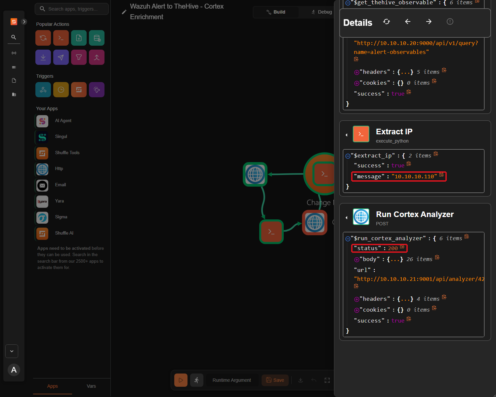

Les alertes portent ensuite leurs observables dès la création. Le cas #9, ouvert depuis une alerte créée par le
compte `SOAR Bot`, en contient trois : le nom de l'hôte, l'empreinte SHA-256 du fichier et son chemin.

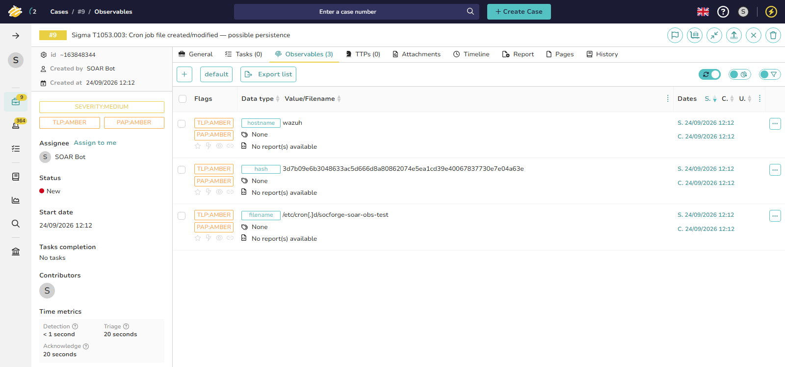

Quand un observable est connu de MISP, le rapport Cortex l'indique sur l'observable lui-même. Ici le fichier cron
correspond à un événement MISP (`MISP:Search="1 event(s)"`), alors que l'empreinte n'en trouve aucun.

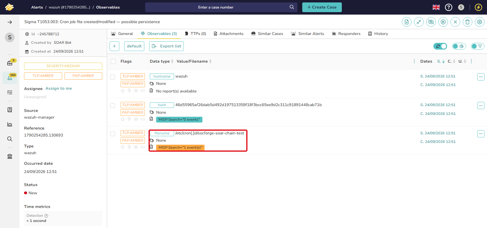

### La chaîne s'allonge : chasse demandée, cas traité

Une correspondance MISP déclenche l'étape suivante : Shuffle republie l'événement MISP concerné, ce qui lance une
chasse Velociraptor (étape 5). L'alerte reçoit les tags `misp:match` et `dfir:hunt-triggered`, et une note datée
écrite par le nœud lui-même. Tout ce que la chaîne fait est ainsi lisible sur l'alerte.

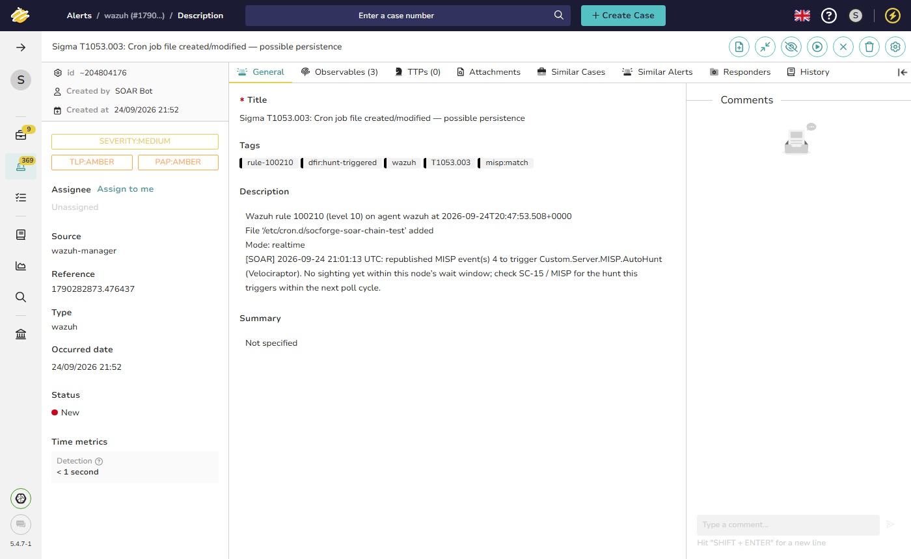

L'alerte est ensuite transformée en cas et traitée avec un modèle de réponse à incident en cinq tâches :
triage, confinement, éradication, récupération, retour d'expérience. Le cas #10 est clos en vrai positif. Le
rapport d'incident correspondant est dans
[`docs/incident-report-2026-09-24-cron-persistence.md`](docs/incident-report-2026-09-24-cron-persistence.md).
Fiche : [SC-14](purple-team/scenarios/SC-14-shuffle-soar-workflow.md).

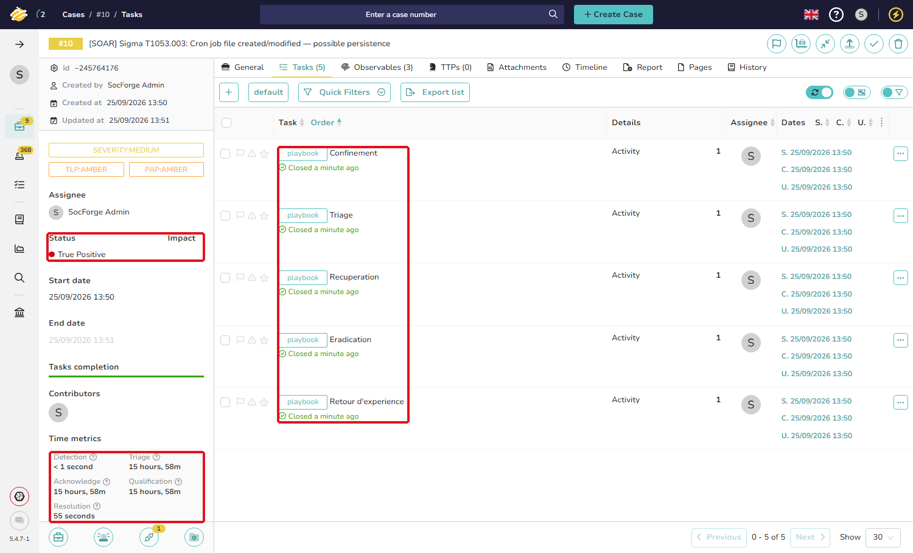

## Étape 5 : chasser sur les postes à partir du renseignement

L'idée de cette étape : un indicateur publié dans MISP doit suffire à lancer une recherche sur les postes, et le
résultat doit revenir dans MISP. Fiche : [SC-15](purple-team/scenarios/SC-15-dfir-velociraptor-misp-hunt.md).

### Une première chasse à la main

Velociraptor cherche dans les journaux PowerShell de WIN01 la chaîne Base64 utilisée dans SC-04. La collecte se
termine en 8 secondes et trouve 3 événements.

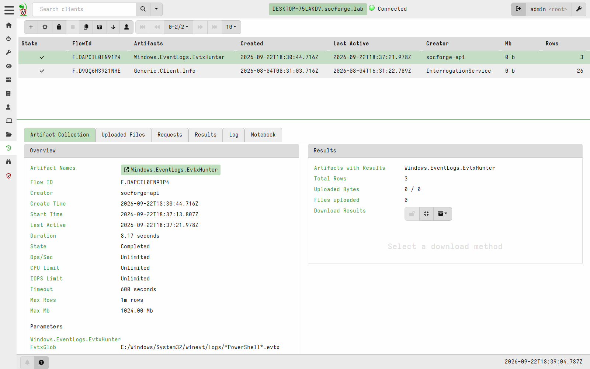

Le détail des résultats montre les événements 4104 avec le bloc de script complet : l'analyste lit la commande
telle qu'elle a été exécutée, cinq jours après les faits.

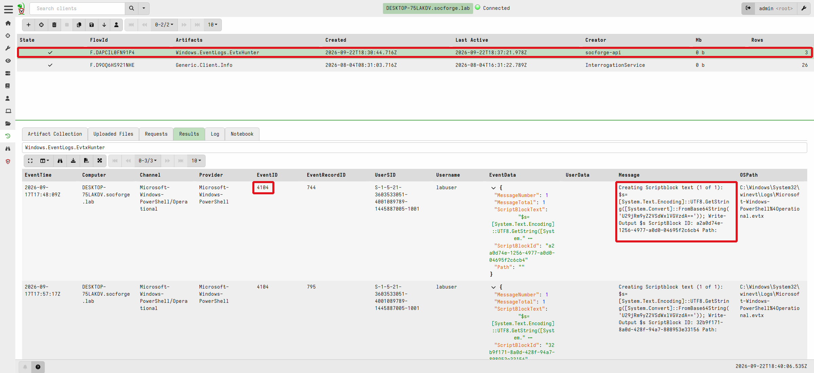

### Les indicateurs passent par MISP

Les indicateurs des scénarios précédents sont regroupés dans l'événement MISP #2 : le nom de la tâche planifiée,
l'adresse de Kali, le fichier cron, la clé Run et la chaîne Base64.

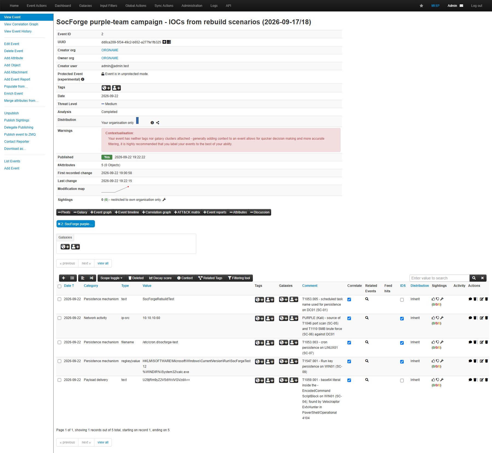

La chasse est relancée avec une expression construite à partir de ces indicateurs. Elle trouve cette fois
11 événements sur WIN01.

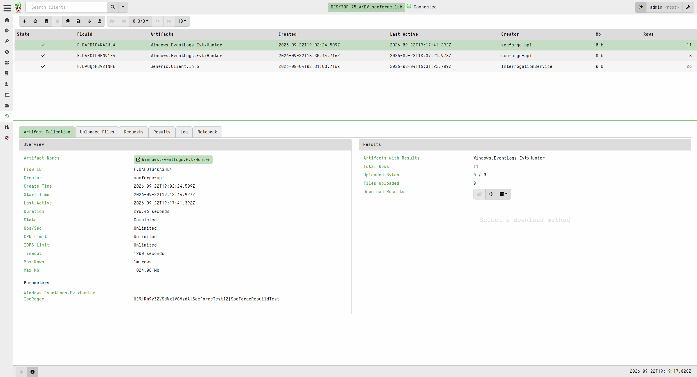

À partir de ces résultats, un notebook reconstitue la chronologie de la clé Run de SC-09 : la commande
`reg add`, l'écriture vue par Sysmon, puis la suppression. La clé n'existait plus sur le poste au moment de la
chasse ; ses traces, si.

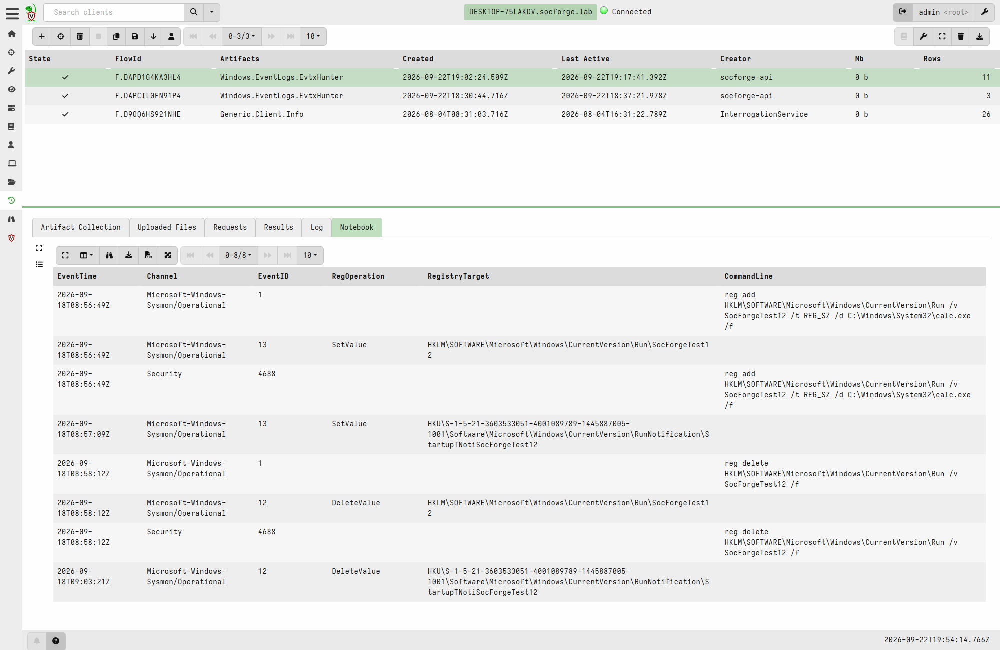

### Velociraptor lit MISP et lui répond

Un artefact serveur écrit pour le lab (`velociraptor/`) lit l'événement MISP et crée la chasse lui-même, avec les
tags `misp` et `misp-event-2` et l'expression tirée des indicateurs.

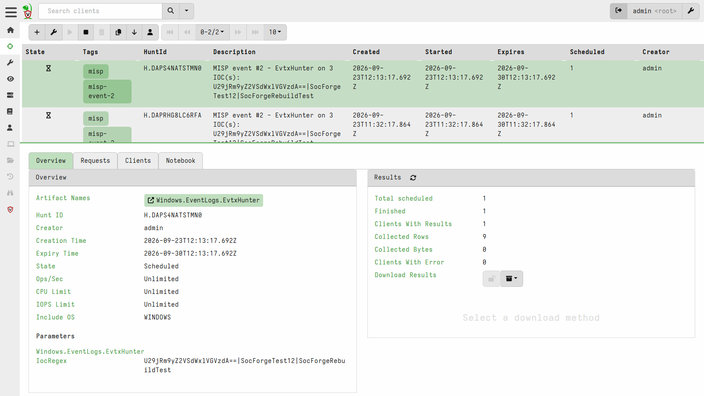

Un second artefact surveille la fin des chasses et renvoie à MISP un sighting par indicateur retrouvé. MISP
répond `200` à chaque envoi.

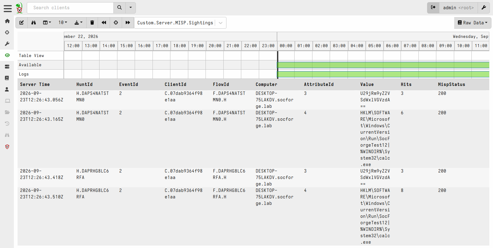

Dans MISP, les deux indicateurs retrouvés sur WIN01 affichent maintenant leurs sightings. Les trois autres, qui
concernent d'autres machines, restent à zéro.

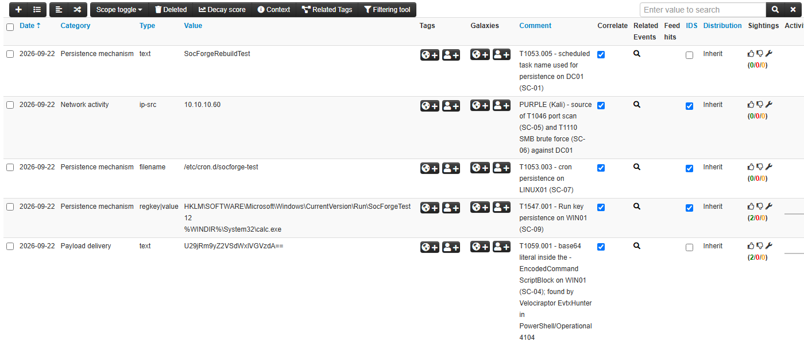

### La boucle tourne seule

Dernier pas : plus aucune commande manuelle. Un événement MISP de test (#3) est publié avec un marqueur bénin
exécuté sur WIN01. Velociraptor le détecte, chasse et renvoie deux sightings.

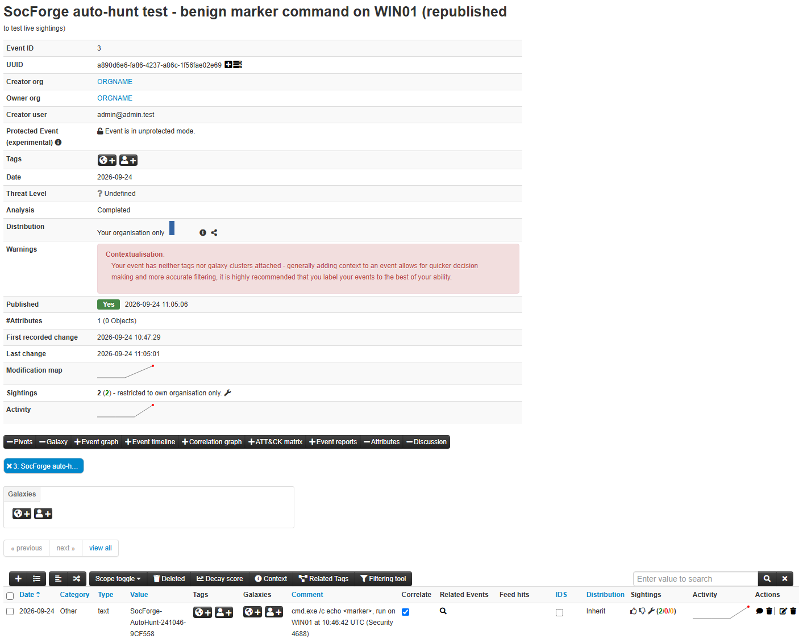

La liste des chasses le confirme : celles du 24/09 ont pour créateur `VelociraptorServer`, le serveur lui-même,
alors que celles de la veille avaient été créées par le compte `admin`.

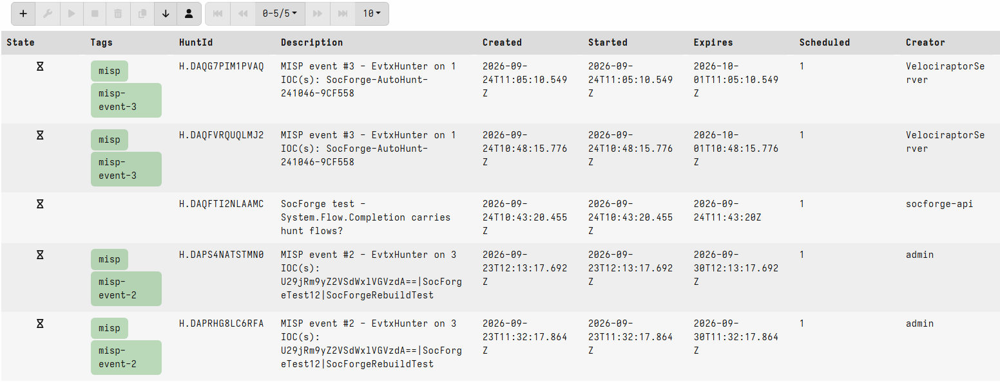

### La même boucle sur Linux

Le 7 octobre, la boucle est rejouée sur LINUX01, qui joint désormais Velociraptor à travers le pare-feu. Un
marqueur bénin est écrit dans le journal système avec `logger`, puis l'événement MISP #7 qui le contient est
publié à 14:09:00. Velociraptor crée la chasse 8 secondes plus tard, sans intervention. LINUX01 rend deux lignes :
celle du journal système et celle de la commande `sudo` dans le journal d'authentification.

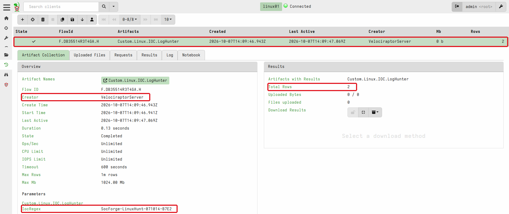

Le sighting arrive dans MISP à 14:09:47, 47 secondes après la publication, avec le nom du poste et l'identifiant
de la chasse.

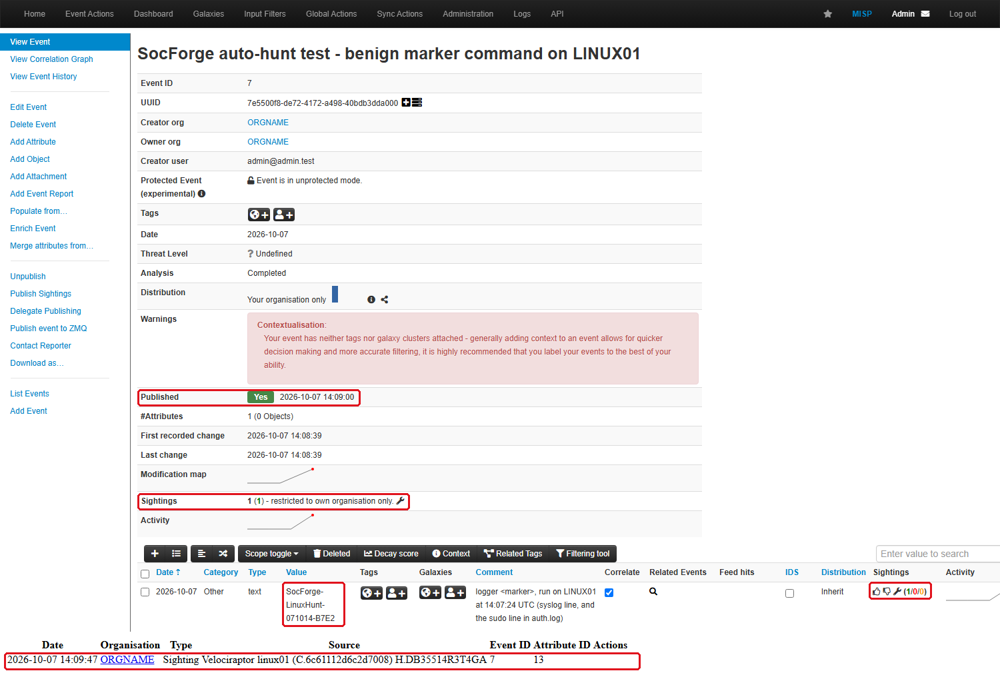

## Étape 6 : une attaque suivie de bout en bout

Tout ce qui précède est assemblé ici, le 7 octobre 2026, sur une seule attaque. Les huit captures de cette étape
viennent toutes de cette exécution. Les machines sont allumées par
groupes, selon leur rôle : d'abord l'attaque et sa détection, puis la chaîne de réponse. L'alerte réelle a été
remise à Shuffle avec le script d'intégration officiel de Wazuh, et les actions ci-dessous sont les actions
réelles de la chaîne. Le détail heure par heure est dans la fiche
[SC-14](purple-team/scenarios/SC-14-shuffle-soar-workflow.md).

### 1. L'attaque et sa détection

Depuis PURPLE, trois accès successifs au partage d'administration de WIN01 avec un compte local valide. Wazuh
signale la session venue de la zone non fiable dès la première connexion (`100179`, niveau 12, 7 secondes), puis
chaque accès au partage (`100140`), et enfin l'escalade `100141` au troisième accès, 27 secondes après le début.

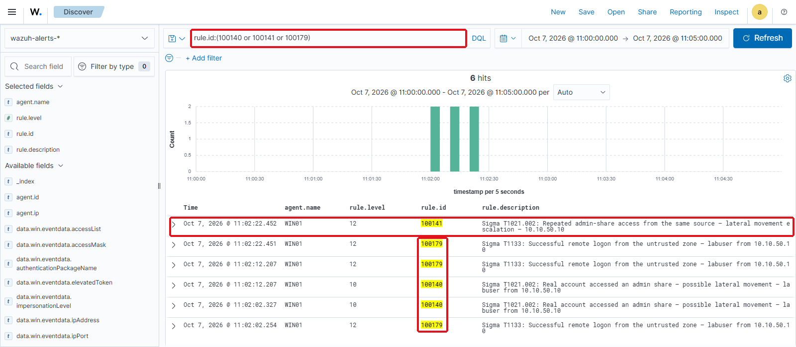

### 2. Shuffle traite l'alerte

L'alerte `100141` traverse les six nœuds en 35 secondes. La capture reprend le résultat de chacun : alerte TheHive
créée (`201`), correspondance MISP trouvée par Cortex, adresse `10.10.50.10` ajoutée au pare-feu, ordre de
quarantaine envoyé à Velociraptor, chasse déclenchée.

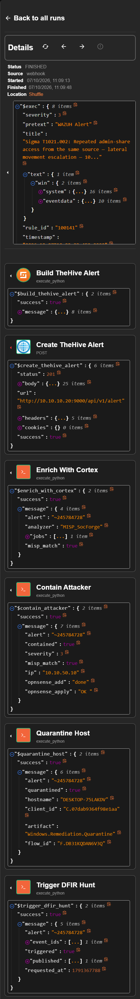

### 3. L'alerte TheHive raconte la suite

Chaque nœud laisse un tag et une note datée sur l'alerte : adresse bloquée à 10:09:37, isolation demandée à
10:09:42, événement MISP republié à 10:09:48, résultat de la chasse à 10:34:29. L'alerte est rattachée au cas #11.

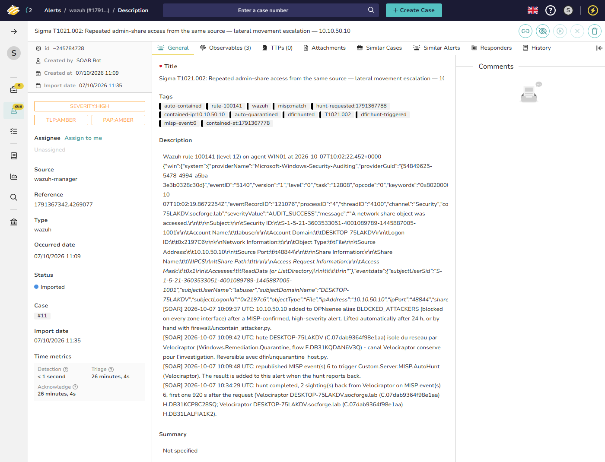

### 4. L'attaquant est bloqué au pare-feu

L'adresse de PURPLE est dans l'alias `BLOCKED_ATTACKERS`, 24 secondes après la livraison de l'alerte.

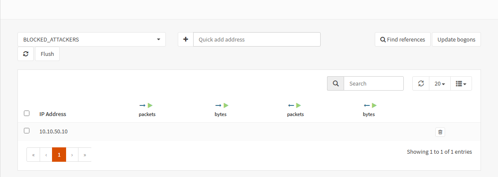

Le journal en direct d'OPNsense montre l'effet : chaque nouvelle tentative de `10.10.50.10` vers le port 445 de
WIN01 est rejetée par la règle `purple -> blocked (SOAR containment)`.

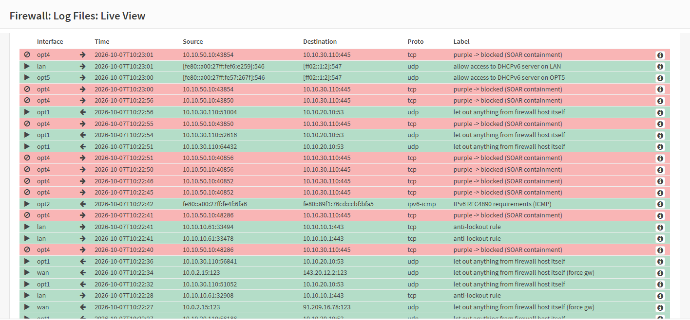

### 5. Le poste est isolé, puis fouillé

Côté Velociraptor, on retrouve sur WIN01 l'ordre de quarantaine envoyé par le compte `soar-api` et la chasse
lancée par le serveur, qui ramène 30 lignes. L'ordre s'applique à la reconnexion du poste : le ping tombe alors à
100 % de perte, tandis que le canal Velociraptor reste ouvert pour l'investigation.

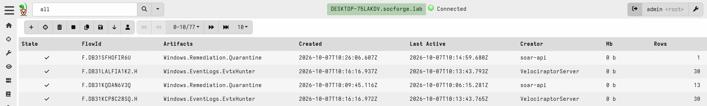

### 6. Le renseignement est mis à jour

L'événement MISP #6, qui contenait déjà l'adresse de l'attaquant, a été republié par la chaîne à 10:09:51. Les
deux sightings de Velociraptor y arrivent à 10:25.

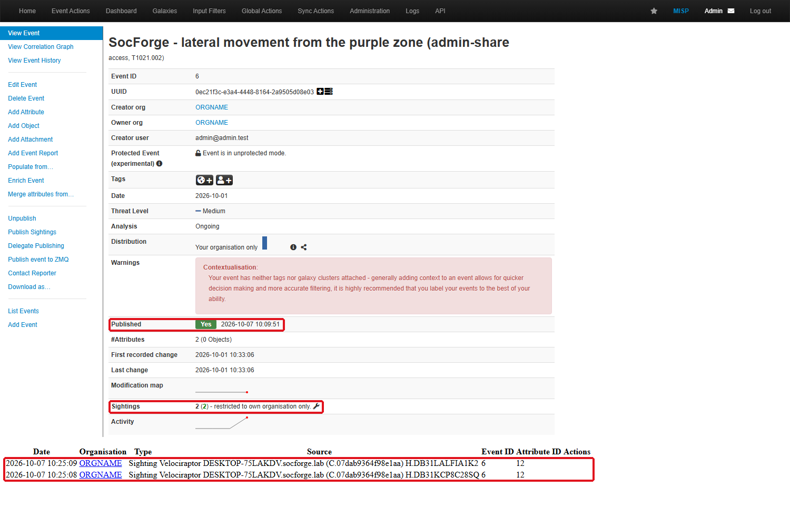

### 7. Le cas est traité et clos

L'alerte devient le cas #11. Les cinq tâches du modèle sont renseignées et le cas est clos en vrai positif. Les
délais affichés sont ceux calculés par TheHive.

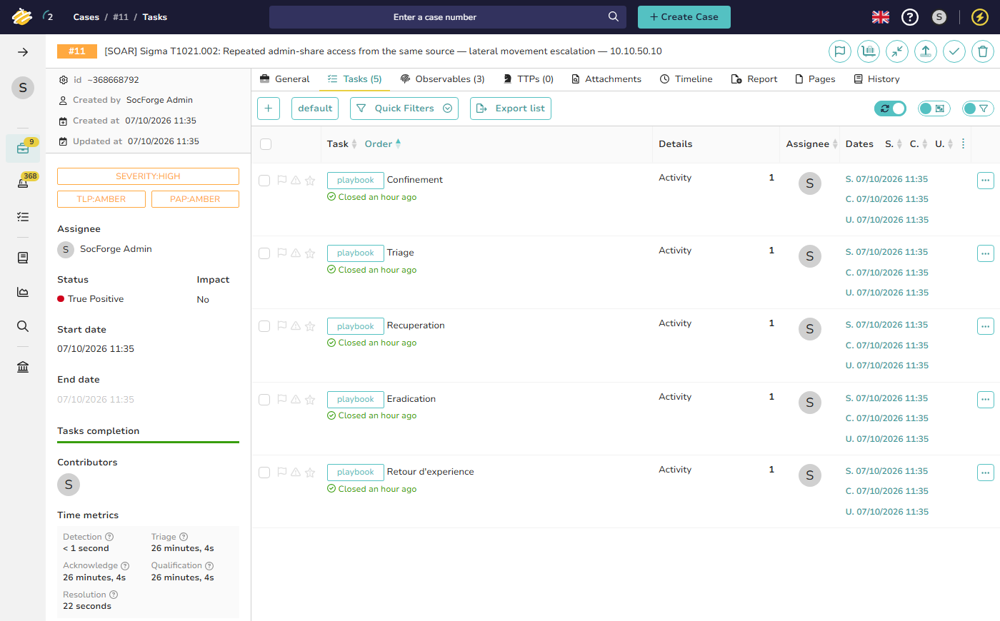

Après l'exercice, l'isolation de WIN01 a été levée et l'adresse retirée de l'alias.

## Ce que le dépôt démontre

- Détection Windows : 20 règles Wazuh rattachées à MITRE ATT&CK, dont les principales ont aussi une forme Sigma dans `detections/sigma/` (15 règles, Windows et Linux).
- Détection Linux : sudo et persistance cron.
- Réseau : une sonde Suricata et Zeek dont les alertes remontent dans Wazuh, et une segmentation à refus par défaut entre cinq zones, journalisée.
- Orchestration : une alerte Wazuh devient une alerte TheHive avec ses observables, est enrichie par Cortex et MISP, puis déclenche le blocage de l'attaquant, l'isolation du poste et la chasse, sans intervention.
- Garde-fous de la réponse automatique : liste d'adresses jamais bloquées, label qui protège le contrôleur de domaine, blocage temporaire, webhook réservé à Wazuh, accès à Velociraptor par une clé SSH limitée à une commande. Ils sont testés dans la fiche [SC-14](purple-team/scenarios/SC-14-shuffle-soar-workflow.md).
- DFIR : un événement MISP publié lance seul une chasse Velociraptor et les sightings reviennent dans MISP. La boucle complète est prouvée sur Windows et sur Linux ; l'isolation d'un poste Linux a été testée séparément.
- Qualité du dépôt : 54 tests automatiques vérifient les règles, la politique du pare-feu, les artefacts, le code des nœuds et les liens de la documentation ; ils tournent à chaque envoi, avec la validation des règles Sigma.
- Chiffrement : les services en HTTPS (MISP, OPNsense) sont appelés avec la CA interne du lab, sans désactiver la vérification. TheHive, Cortex et Shuffle ne sont joignables que depuis le réseau de gestion, isolé de l'attaquant et des cibles, et sont appelés en HTTP.

## Scénarios

Les fiches SC-01 à SC-11 ont été écrites avant le retrait des cartes de gestion des cibles (07/10) : les adresses `10.10.10.109`, `10.10.10.110` et `10.10.10.111` qu'elles citent sont celles que DC01, WIN01 et LINUX01 avaient alors sur le réseau de gestion. Leurs adresses actuelles sont `10.10.20.10`, `10.10.30.110` et `10.10.30.20` (voir l'[inventaire](docs/lab-registry.md)).

| # | Technique | Fiche |
|---|---|---|
| SC-01 | T1053.005 Tâche planifiée | [SC-01-T1053-scheduled-task.md](purple-team/scenarios/SC-01-T1053-scheduled-task.md) |
| SC-02 | T1078 Compte valide, logon réseau | [SC-02-T1078-valid-account.md](purple-team/scenarios/SC-02-T1078-valid-account.md) |
| SC-03 | T1021.002 Partages admin : filtrage du bruit | [SC-03-T1021-lateral-movement.md](purple-team/scenarios/SC-03-T1021-lateral-movement.md) |
| SC-04 | T1059.001 PowerShell encodé | [SC-04-T1059-powershell-encoded.md](purple-team/scenarios/SC-04-T1059-powershell-encoded.md) |
| SC-05 | T1046 Scan de ports depuis Kali | [SC-05-T1046-port-scan.md](purple-team/scenarios/SC-05-T1046-port-scan.md) |
| SC-06 | T1110 Brute force SMB | [SC-06-T1110-brute-force.md](purple-team/scenarios/SC-06-T1110-brute-force.md) |
| SC-07 | T1548.003 / T1053.003 sudo et cron (Linux) | [SC-07-T1548-T1053-linux.md](purple-team/scenarios/SC-07-T1548-T1053-linux.md) |
| SC-08 | T1021.002 + T1078 Mouvement latéral WIN01 → DC01 | [SC-08-T1021-win01-to-dc01.md](purple-team/scenarios/SC-08-T1021-win01-to-dc01.md) |
| SC-09 | T1547.001 Clé Run | [SC-09-T1547-registry-run-key.md](purple-team/scenarios/SC-09-T1547-registry-run-key.md) |
| SC-10 | T1055 Injection de processus | [SC-10-T1055-process-injection.md](purple-team/scenarios/SC-10-T1055-process-injection.md) |
| SC-11 | T1003 Accès LSASS, bloqué sur WIN01 (protection LSA), validé en direct sur DC01 | [SC-11-T1003-lsass-access.md](purple-team/scenarios/SC-11-T1003-lsass-access.md) |
| SC-12 | NDR : capture et détection d'un scan | [SC-12-ndr-purple-scan.md](purple-team/scenarios/SC-12-ndr-purple-scan.md) |
| SC-13 | TheHive + Cortex | [SC-13-thehive-cortex-100155.md](purple-team/scenarios/SC-13-thehive-cortex-100155.md) |
| SC-14 | SOAR Wazuh → Shuffle → TheHive → Cortex → MISP | [SC-14-shuffle-soar-workflow.md](purple-team/scenarios/SC-14-shuffle-soar-workflow.md) |
| SC-15 | Chasse Velociraptor pilotée par MISP | [SC-15-dfir-velociraptor-misp-hunt.md](purple-team/scenarios/SC-15-dfir-velociraptor-misp-hunt.md) |
| SC-16 | Segmentation OPNsense | [SC-16-firewall-segmentation.md](purple-team/scenarios/SC-16-firewall-segmentation.md) |

## Organisation du dépôt

| Dossier | Contenu |
|---|---|
| `wazuh/rules/` | règles SocForge (Windows/Sigma, Linux, pare-feu, NDR) |
| `wazuh/agents/` | configurations centralisées des agents (Windows, Linux, NDR) |
| `wazuh/manager/` | intégration Shuffle et écoute syslog du manager |
| `firewall/` | politique de segmentation OPNsense, script d'application par API, confinement/déconfinement d'un attaquant |
| `dfir/` | isolation/levée d'isolation d'un hôte compromis via Velociraptor (Windows et Linux) ; `server/` : compte restreint utilisé par Shuffle |
| `sysmon/` | configuration Sysmon du contrôleur de domaine |
| `detections/sigma/` | règles Sigma, validées par la CI |
| `tests/` | tests automatiques (règles, politique du pare-feu, artefacts, nœuds SOAR, liens) |
| `ndr/` | configuration de la sonde : interfaces écoutées, Suricata, cluster Zeek |
| `pki/` | CA interne du lab (certificat public) et script d'émission des certificats |
| `soar/` | création des workflows Shuffle (`nodes/` : code des nœuds de confinement, d'isolation d'hôte, de déclenchement de chasse DFIR et des tâches planifiées de suivi) ; filtre d'accès au webhook |
| `velociraptor/` | artefacts MISP ↔ Velociraptor (serveur) et chasse Linux (client) |
| `detections/` | fiches de détection Windows et Linux |
| `purple-team/scenarios/` | une fiche par scénario (SC-01 à SC-16) |
| `docs/` | plan de reconstruction, inventaire, métriques, rapport d'incident, schéma d'architecture, captures (`screenshots/`) |

## Chronologie

Première réalisation du 2 au 15 août 2026, pause, puis reconstruction et audit du 13 septembre au 7 octobre 2026
(détail dans [`docs/rebuild-plan.md`](docs/rebuild-plan.md)).
