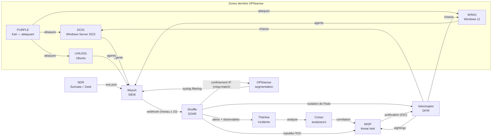

# SocForge — laboratoire SOC de bout en bout

SOC complet monté sur un seul PC (16 Go de RAM, VirtualBox) : 12 machines virtuelles,
de la détection à la réponse. Chaque détection est déclenchée par une attaque réelle
mais bénigne, observée dans le SIEM, puis documentée avec ses preuves : extraits de
journaux, heures UTC et captures.

Le projet documente aussi ce qui n'a **pas** marché du premier coup. Une bonne partie
de sa valeur est là : règles qui ne se déclenchaient jamais sans erreur visible, sonde
réseau sans signatures, pare-feu sans segmentation, SIEM tombé en silence faute de
disque. Chaque défaut a été trouvé, expliqué et corrigé à la racine.

## Architecture

Inventaire complet (adresses, versions, flux) : [`docs/lab-registry.md`](docs/lab-registry.md).
Métriques MTTD/MTTA/MTTR calculées sur les tests réels : [`docs/metrics-mttd-mtta-mttr.md`](docs/metrics-mttd-mtta-mttr.md).
Exemple de rapport d'incident de bout en bout : [`docs/incident-report-2026-09-24-cron-persistence.md`](docs/incident-report-2026-09-24-cron-persistence.md).

## Ce qui est démontré

| Domaine | Résultat | Preuve |
|---|---|---|
| Détection Windows | 16 règles Sigma → Wazuh, toutes validées en direct (PowerShell encodé, tâche planifiée, clé Run, injection, mouvement latéral, profil PowerShell, accès LSASS…) | [`detection-sheet-windows.md`](detections/windows/detection-sheet-windows.md) |
| Détection Linux | sudo, persistance cron | [`detection-sheet-linux.md`](detections/linux/detection-sheet-linux.md) |
| Réseau | Suricata (52 795 signatures ET Open) détecte un scan, alerte niveau 10 dans Wazuh | [SC-12](purple-team/scenarios/scenario-ndr-purple-scan.md) |
| Segmentation | politique de refus par défaut entre 6 zones, attaquant sans accès au réseau d'administration, blocages visibles dans Wazuh | [SC-16](purple-team/scenarios/scenario-firewall-segmentation.md) |
| SIEM → SOAR → CTI | alerte Wazuh → Shuffle → TheHive (avec observables) → Cortex → MISP en **une seule exécution, 33 s**, sans action humaine ; tag `misp:match` sur l'alerte | [SC-14](purple-team/scenarios/scenario-shuffle-soar-workflow.md) |
| Gestion d'incident | alertes Wazuh promues en cas TheHive (licence StrangeBee), observables repris | [SC-14](purple-team/scenarios/scenario-shuffle-soar-workflow.md) |
| DFIR | publication d'un événement MISP → chasse Velociraptor lancée **automatiquement** sur les postes Windows → sightings renvoyés à MISP dès la fin de la chasse ; persistance retrouvée alors que la clé était supprimée | [SC-15](purple-team/scenarios/scenario-dfir-velociraptor-misp-hunt.md) |
| Réponse automatique (réseau) | une alerte confirmée (sévérité ≥ 3, `misp:match`) fait bloquer son IP sur OPNsense par Shuffle lui-même, sans analyste — réversible par script | [SC-14](purple-team/scenarios/scenario-shuffle-soar-workflow.md) |
| Réponse automatique (hôte) | l'hôte compromis est isolé du réseau par Velociraptor (canal de gestion conservé), une fois le confinement réseau déjà déclenché — réversible par script | [SC-14](purple-team/scenarios/scenario-shuffle-soar-workflow.md) |
| Boucle SOAR → DFIR | un `misp:match` posé par la chaîne SOAR republie l'IOC dans MISP et déclenche la chasse Velociraptor correspondante, sans intervention | [SC-14](purple-team/scenarios/scenario-shuffle-soar-workflow.md) |
| Processus d'investigation | modèle de cas TheHive réutilisable (triage → confinement → éradication → récupération → REX), appliqué à un incident réel et clos | [SC-14](purple-team/scenarios/scenario-shuffle-soar-workflow.md) |
| Chiffrement | TLS vérifié entre les outils (CA interne du lab), aucune vérification désactivée | [SC-15](purple-team/scenarios/scenario-dfir-velociraptor-misp-hunt.md), [SC-16](purple-team/scenarios/scenario-firewall-segmentation.md) |

## Scénarios

| # | Technique | Fiche |
|---|---|---|
| SC-01 | T1053.005 Tâche planifiée | [scenario-T1053-scheduled-task.md](purple-team/scenarios/scenario-T1053-scheduled-task.md) |
| SC-02 | T1078 Compte valide, logon réseau | [scenario-T1078-valid-account.md](purple-team/scenarios/scenario-T1078-valid-account.md) |
| SC-03 | T1021.002 Partages admin : filtrage du bruit | [scenario-T1021-lateral-movement.md](purple-team/scenarios/scenario-T1021-lateral-movement.md) |
| SC-04 | T1059.001 PowerShell encodé | [scenario-T1059-powershell-encoded.md](purple-team/scenarios/scenario-T1059-powershell-encoded.md) |
| SC-05 | T1046 Scan de ports depuis Kali | [scenario-T1046-port-scan.md](purple-team/scenarios/scenario-T1046-port-scan.md) |
| SC-06 | T1110 Brute force SMB | [scenario-T1110-brute-force.md](purple-team/scenarios/scenario-T1110-brute-force.md) |
| SC-07 | T1548.003 / T1053.003 sudo et cron (Linux) | [scenario-T1548-T1053-linux.md](purple-team/scenarios/scenario-T1548-T1053-linux.md) |
| SC-08 | T1021.002 + T1078 Mouvement latéral WIN01 → DC01 | [scenario-T1021-win01-to-dc01.md](purple-team/scenarios/scenario-T1021-win01-to-dc01.md) |
| SC-09 | T1547.001 Clé Run | [scenario-T1547-registry-run-key.md](purple-team/scenarios/scenario-T1547-registry-run-key.md) |
| SC-10 | T1055 Injection de processus | [scenario-T1055-process-injection.md](purple-team/scenarios/scenario-T1055-process-injection.md) |
| SC-11 | T1003 Accès LSASS — bloqué sur WIN01 (protection LSA), validé en direct sur DC01 | [scenario-T1003-lsass-access.md](purple-team/scenarios/scenario-T1003-lsass-access.md) |
| SC-12 | NDR : capture et détection d'un scan | [scenario-ndr-purple-scan.md](purple-team/scenarios/scenario-ndr-purple-scan.md) |
| SC-13 | TheHive + Cortex | [scenario-thehive-cortex-100155.md](purple-team/scenarios/scenario-thehive-cortex-100155.md) |
| SC-14 | SOAR Wazuh → Shuffle → TheHive → Cortex → MISP | [scenario-shuffle-soar-workflow.md](purple-team/scenarios/scenario-shuffle-soar-workflow.md) |
| SC-15 | Chasse Velociraptor pilotée par MISP | [scenario-dfir-velociraptor-misp-hunt.md](purple-team/scenarios/scenario-dfir-velociraptor-misp-hunt.md) |
| SC-16 | Segmentation OPNsense | [scenario-firewall-segmentation.md](purple-team/scenarios/scenario-firewall-segmentation.md) |

## Quelques défauts trouvés en chemin

- **Règles qui ne sonnaient jamais, sans aucune erreur** : groupes mal nommés
  (`sysmon_event10` au lieu de `sysmon_event_10`), groupe inexistant
  (`windows_powershell`), `<same_source_ip/>` inopérant sur les événements Windows, règle
  de bruit court-circuitée par une règle officielle du même niveau. À chaque fois, la
  preuve a été apportée par `wazuh-logtest`, un test A/B ou la lecture des alertes réelles.
- **FIM** : le profil PowerShell n'était jamais surveillé (chemin masqué par la config
  locale de l'agent), et `report_changes` sur Program Files saturait le quota et bloquait
  le scan.
- **Infrastructure** : SIEM arrêté quatre jours par un disque plein, horloges faussées de
  plusieurs heures, NDR sans signatures, pare-feu sans aucune règle entre zones.
- **Une cause racine derrière plusieurs symptômes** : un écran bleu de WIN01, analysé avec
  WinDbg, a mené au journal VirtualBox : l'hyperviseur Windows (Intégrité de la mémoire)
  occupait AMD-V, et VirtualBox tournait en mode de repli. C'était la cause commune de la
  dérive des horloges, des gels de disque et des blocages au démarrage des VM.
- **Rôles** : TheHive se connectait à Cortex avec un compte `superadmin`, qui ne peut pas
  lancer d'analyseur ; l'administrateur de l'organisation TheHive n'avait aucun droit sur
  les incidents. Comptes corrigés selon le moindre privilège.

Le détail de chaque correction est dans [`docs/rebuild-plan.md`](docs/rebuild-plan.md).

## Organisation du dépôt

| Dossier | Contenu |
|---|---|
| `wazuh/rules/` | règles SocForge (Windows/Sigma, Linux, pare-feu, NDR) |
| `wazuh/agents/` | configurations centralisées des agents (Windows, Linux, NDR) |
| `wazuh/manager/` | intégration Shuffle et écoute syslog du manager |
| `firewall/` | politique de segmentation OPNsense, script d'application par API, confinement/déconfinement d'un attaquant |
| `dfir/` | isolation/levée d'isolation d'un hôte compromis via Velociraptor (`Windows.Remediation.Quarantine`) |
| `ndr/` | configuration de la sonde : interfaces écoutées, Suricata, cluster Zeek |
| `pki/` | CA interne du lab (certificat public) et script d'émission des certificats |
| `soar/` | création du workflow Shuffle déclenché par Wazuh (`nodes/` : code des nœuds de confinement, d'isolation d'hôte et de déclenchement de chasse DFIR) |
| `velociraptor/` | artefacts serveur MISP ↔ Velociraptor |
| `detections/` | fiches de détection Windows et Linux |
| `purple-team/scenarios/` | une fiche par scénario (SC-01 à SC-16) |
| `docs/` | plan de reconstruction, inventaire, captures |

## Limites connues

- **Licence TheHive** : essai `Platinum` valable jusqu'au 08/10/2026 ; une licence
  Community la remplacera pour que le lab reste utilisable ensuite.
- **Budget matériel** : 3 VM au maximum en usage courant (16 Go). La chaîne SOAR complète
  a été validée avec les 5 VM nécessaires, en réduisant temporairement leur mémoire.
- **Réseau mgmt** non filtré : c'est le réseau d'administration hors bande du lab.
  L'attaquant n'y a pas de carte ; ses tentatives vers ce réseau traversent le pare-feu,
  qui les bloque et les journalise (SC-16).

## Chronologie

Première réalisation du 2 au 15 août 2026, pause, puis reconstruction et audit du 13 au
24 septembre 2026 (détail dans [`docs/rebuild-plan.md`](docs/rebuild-plan.md)).
